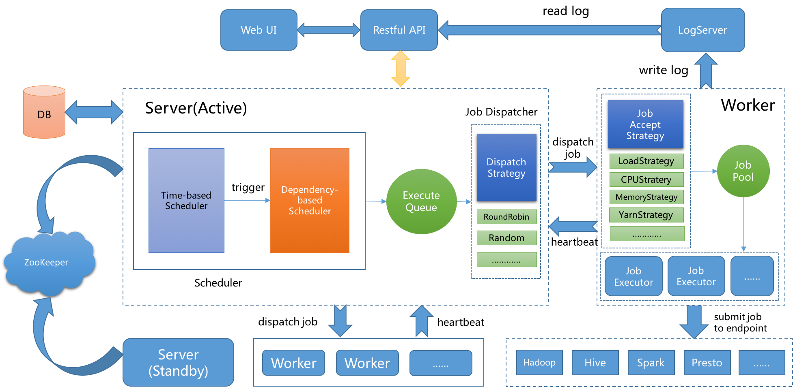
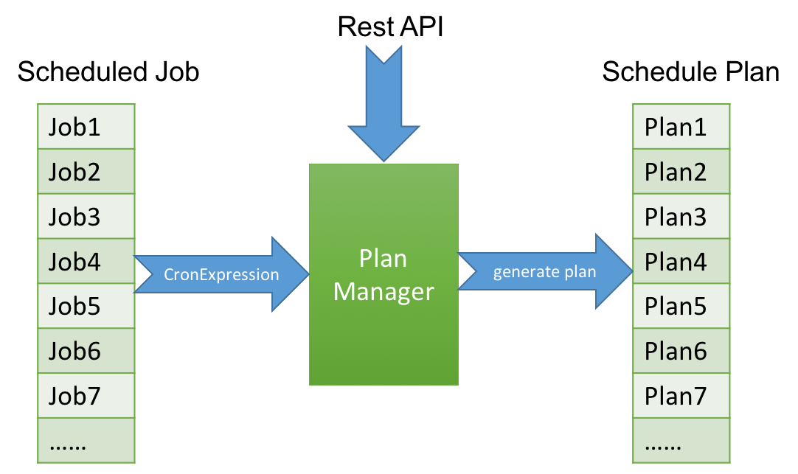
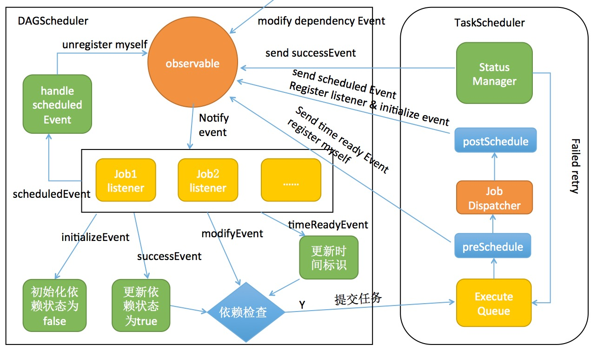
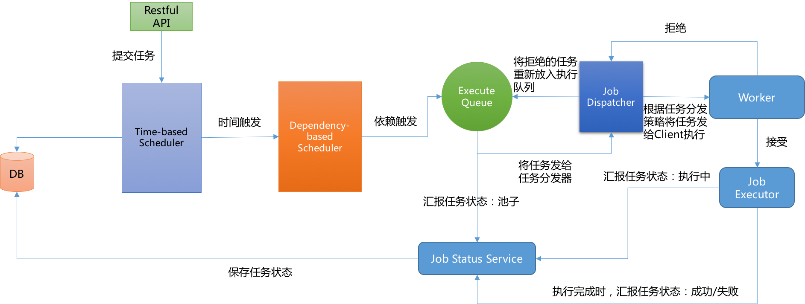
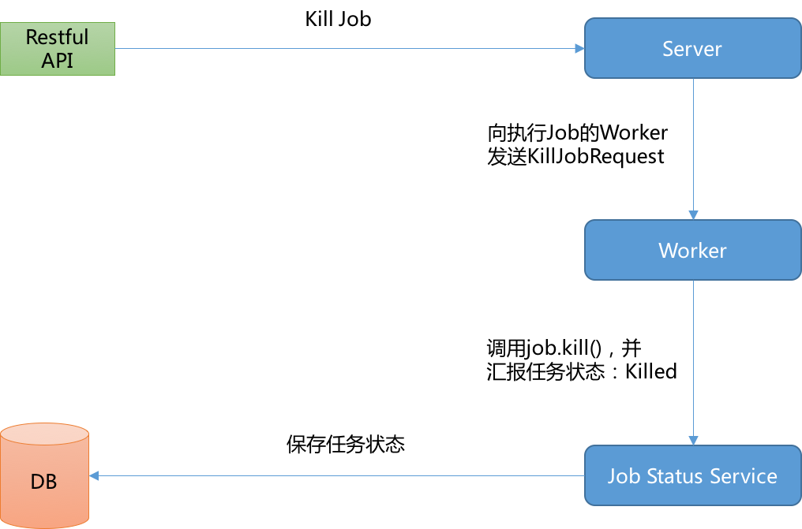
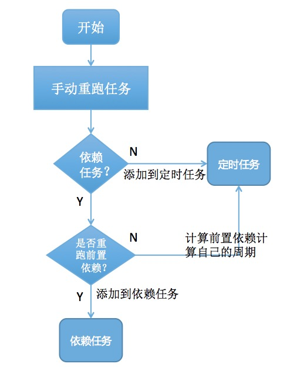
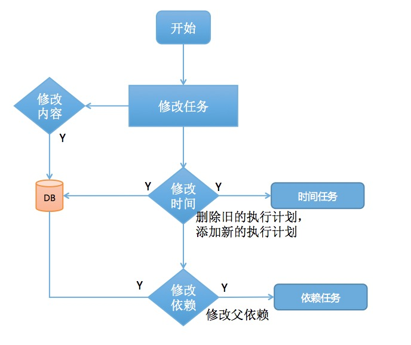

# 调度系统重构设计说明书

## 一、引言

数据平台现有的调度系统(Jarvis)、哨兵系统(Sentinel)存在一些设计与实现上的不足，缺乏足够的稳定性与扩展性，不利于后期维护。本次重构将改进系统整体设计，以Akka开源框架为核心，提升系统稳定性及扩展性。

## 二、总体设计

### 2.1 需求概述

- 系统具备足够的稳定性、扩展性，支持任务的并行调度，保证任务不重复、不错漏执行
- 提高系统的容错性，主要组件无状态化，以便于服务的快速恢复
- 支持多种类型（自定义扩展）的任务执行，如：Hive、Shell、MapReduce、Spark等
- 不同类型的任务具有各自的任务接收策略，以支持对后端系统（如：Hadoop）的特定控制，如：流控、Load、CPU使用率、内存使用率等
- 任务支持重试、重试次数、重试间隔的配置
- 改进通信协议，采用更可靠的通信机制（Netty + Protocol Buffers）
- 支持时间触发、依赖触发两种调度方式
- 能够方便地修改执行计划
- 支持细粒度周期（小于天）任务的调度
- 支持对不同调度周期的任务依赖配置
- 统一的日志收集中心，更好地支持日志的随机读写（offset + lines），并改进对有实时读取日志需求应用的支持（如：Ironman）
- 支持任务的非功能性扩展，如：用户权限验证
- 开放系统接口，对外提供REST API

### 2.2 系统设计

#### 2.2.1 系统组成

- Server
  
  > 主要由调度器（时间调度器、依赖调度器）、执行队列、任务分发器组成
  > 
  > 对任务（包括周期性、非周期性）进行调度管理，根据任务的时间或依赖条件以及分发策略将任务发送给对应的Worker执行
  > 
  > 监听Worker的注册信息
  > 
  > 接收Worker发送的心跳汇报
  > 
  > 以HA方式运行

- Worker
  
  > 向Server注册信息
  > 
  > 根据接收策略决定是否接受Server发送的任务
  > 
  > 执行接受的任务并管理其生命周期
  > 
  > 周期性向Server汇报心跳、任务统计信息等
  > 
  > 将任务运行过程中输出的日志发送给LogServer存储
  
- LogServer
  
  > 接收Worker发送的日志，将日志写入相应的存储系统中（如：本地文件系统、分布式文件系统、数据库）
  > 
  > 接收Rest Server的日志读请求，将读取的日志返回
  
- RestServer
  
  > 与Server、Worker、LogServer进行数据交互，提供统一的REST API（任务调度、任务修改、状态查询、日志查询、Worker的上下线等）
  
- WebUI
  
  > 为用户提供Web操作界面，如：应用接入、配置任务、任务查看、重跑任务等
  
- 数据库
  
  > 存储接入应用的配置信息
  > 
  > 存储任务的配置信息（类型、调度时间、依赖、创建者等），任务的执行记录等

### 2.3 模块设计

#### 2.3.1 时间调度器(Time-based Scheduler)

	时间调度器负责调度基于时间触发的任务，支持Cron表达式时间配置。

	时间调度器从数据库中加载周期性调度任务，或者从Rest API请求增加/修改/删除任务。根据任务配置的调度时间(CronExpression)，调度器定时计算出每个任务后面一段时间内（如：一天）的具体调度时间，并生成调度计划(Schedule Plan)。

- 调度计划中的任务按照调度时间升序排序，调度器依次轮询检查任务的调度时间是否到达，到达调度时间的任务将被触发以等待执行
- 当任务的调度时间被修改时，调度器将从调度计划中删除该任务已生成的计划，然后重新生成新的调度计划
- 为使调度计划可恢复，调度计划存储于数据库中。

#### 2.3.2 依赖调度器(Dependency-based Scheduler)

	依赖调度器负责调度基于依赖触发的任务，支持调度周期不相同的依赖配置。

	依赖调度器内部维护任务的依赖满足条件，并采用事件方式触发任务。当某个任务执行完成后，依赖调度器收到消息通知，根据完成任务的ID和状态更新依赖关系数据，然后检查依赖此任务的任务是否所有依赖任务都已成功，若满足则触发，并重置依赖任务的状态等待下次触发。

- 当依赖任务的状态无法通知时（如：重跑任务），依赖调度器从数据库中获取依赖任务的状态
- 任务的依赖修改时，更新依赖关系数据

#### 2.3.3 任务分发器(Job Dispatcher)

	任务分发器负责按照分发策略将Server端的任务发送给相应的Worker执行，以实现负载均衡。

- 任务分发策略可自定义扩展
- 默认的分发策略：轮询分发策略(RoundRobin)、随机分发策略(Random)
- 按照任务的优先级分发
- 当分发的任务被Worker拒绝时，任务分发器将选择同一个组内的另一个Worker分发
- 未避免任务分发过于频繁，当所有的Worker都拒绝后，任务分发器需间隔一段时间后再尝试重新发送
- 当任务运行失败时，根据重试配置重新分发任务

	

#### 2.3.4 任务接受策略(Job Accept Strategy)

	任务接受策略用于控制Worker或任务后端执行系统的负载，Worker根据负载情况决定是否接受Server发送的任务。

- 任务接受策略可自定义扩展
- 每种类型的任务可定义各自不同的接受策略
- 默认实现的任务接受策略：

	Worker：LoadStrategy、CPUStratery、MemoryStrategy

	Hive任务：YarnStrategy

### 2.4 处理流程

#### 2.4.1 任务执行流程

#### 2.4.2 任务终止流程

#### 2.4.3 任务重跑流程

#### 2.4.4 调度计划修改流程

### 2.5 涉及技术

- 分布式：Akka
- 依赖注入：Spring
- 数据库连接池：HikariCP
- DAO：MyBatis
- 内部通讯协议：Netty 、Protocol Buffers
- RESTful：Jersey
- 其它：guava

## 三、接口设计

### 3.1 内部接口

Server、Worker、LogServer、RestServer之间的通信接口均采用Protocol Buffers。

#### 3.1.1 提交任务(Server -> Worker)

Server请求

| 字段         | 类型     | 必选   | 默认值  | 描述        | 
| :--------- | ------ | ---- | ---- | --------- | 
| job_id     | int64  | T    |      | 任务ID      | 
| job_name   | string | T    |      | 任务名称      | 
| app_name   | string | T    |      | 应用名称      | 
| app_key    | string | T    |      | 应用授权Key   | 
| user       | string | T    |      | 用户名       | 
| job_type   | string | T    |      | 任务类型      | 
| command    | string | T    |      | 执行命令      | 
| group_id   | int32  | T    |      | Worker组ID | 
| priority   | int32  | F    | 1    | 优先级       | 
| parameters | string | F    |      | 扩展参数      | 

Worker响应

| 字段      | 类型     | 必选   | 默认值  | 描述          | 
| ------- | ------ | ---- | ---- | ----------- | 
| job_id  | int64  | F    | -1   | 任务ID        | 
| accept  | bool   | T    |      | 是否被Worker接受 | 
| message | string | F    |      |             | 

#### 3.1.2 终止任务(Server -> Worker)

Server请求

| 字段     | 类型    | 必选   | 默认值  | 描述   | 
| ------ | ----- | ---- | ---- | ---- | 
| job_id | int64 | T    |      | 任务ID | 

Worker响应

| 字段      | 类型   | 必选   | 默认值  | 描述     | 
| ------- | ---- | ---- | ---- | ------ | 
| success | bool | T    |      | 是否终止成功 | 

#### 3.1.3 任务状态汇报(Worker -> Server)

Worker请求

| 字段        | 类型    | 必选   | 默认值  | 描述   | 
| --------- | ----- | ---- | ---- | ---- | 
| job_id    | int64 | T    |      | 任务ID | 
| status    | int32 | F    | -1   | 状态   | 
| timestamp | int64 | F    | 0    | 时间戳  | 

Server响应

| 字段      | 类型   | 必选   | 默认值  | 描述     | 
| ------- | ---- | ---- | ---- | ------ | 
| success | bool | T    |      | 是否请求成功 | 

#### 3.1.4 日志写入(Worker -> LogServer)

Worker请求

| 字段     | 类型     | 必选   | 默认值  | 描述                 | 
| ------ | ------ | ---- | ---- | ------------------ | 
| job_id | int64  | T    |      | 任务ID               | 
| log    | string | T    |      | 日志内容               | 
| type   | int32  | T    |      | 日志类型：stdout、stderr | 
| is_end | bool   | T    |      | 日志写请求是否结束          | 

LogServer响应

| 字段      | 类型   | 必选   | 默认值  | 描述     | 
| ------- | ---- | ---- | ---- | ------ | 
| success | bool | T    |      | 是否请求成功 | 

#### 3.1.5 日志读取(RestServer -> LogServer)

RestServer请求

| 字段     | 类型    | 必选   | 默认值  | 描述                 | 
| ------ | ----- | ---- | ---- | ------------------ | 
| job_id | int64 | T    |      | 任务ID               | 
| type   | int32 | T    |      | 日志类型：stdout、stderr | 
| offset | int64 | F    | 0    | 日志内容的字节偏移量         | 
| lines  | int32 | F    | 100  | 日志读取的行数            | 

LogServer响应

| 字段     | 类型     | 必选   | 默认值  | 描述           | 
| ------ | ------ | ---- | ---- | ------------ | 
| is_end | bool   | T    |      | 是否请求成功       | 
| log    | string | F    |      | 日志内容         | 
| offset | int64  | T    |      | 当前日志内容的字节偏移量 | 

#### 3.1.6 心跳汇报(Worker -> Server)

Worker请求

| 字段       | 类型     | 必选   | 默认值  | 描述          | 
| -------- | ------ | ---- | ---- | ----------- | 
| key      | string | T    |      | Worker授权Key | 
| group_id | int32  | T    |      | Worker组ID   | 
| job_num  | int32  | T    |      | 正在运行的任务数    | 

Server响应

| 字段      | 类型   | 必选   | 默认值  | 描述     | 
| ------- | ---- | ---- | ---- | ------ | 
| success | bool | T    |      | 是否请求成功 | 

#### 3.1.7 Worker上下线(RestServer -> Worker)

RestServer请求

| 字段      | 类型     | 必选   | 默认值  | 描述                  | 
| ------- | ------ | ---- | ---- | ------------------- | 
| ip      | string | T    |      | Worker授权Key         | 
| port    | int32  | T    |      | Worker组ID           | 
| offline | bool   | T    |      | 状态：True-下线，False-上线 | 

Worker响应

| 字段      | 类型   | 必选   | 默认值  | 描述     | 
| ------- | ---- | ---- | ---- | ------ | 
| success | bool | T    |      | 是否请求成功 | 

### 3.2 外部接口

RestServer对外提供REST API。

#### 3.2.1 执行任务

接口：/server/execute

Method：POST

| 字段       | 类型     | 必选   | 默认值  | 描述        | 
| -------- | ------ | ---- | ---- | --------- | 
| token    | string | T    |      | 接口调用口令    | 
| time     | long   | T    |      | 时间戳       | 
| name     | string | T    |      | 应用名称      | 
| content  | string | T    |      | 执行命令      | 
| jobName  | string | T    |      | 任务名称      | 
| executor | string | T    |      | 用户名称      | 
| jobType  | string | F    | hive | 任务类型      | 
| groupId  | int    | F    | 1    | Worker组ID | 

#### 3.2.2 获取日志

接口：/server/querylog

Method：POST

| 字段    | 类型     | 必选   | 默认值  | 描述     | 
| ----- | ------ | ---- | ---- | ------ | 
| token | string | T    |      | 接口调用口令 | 
| time  | long   | T    |      | 时间戳    | 
| name  | string | T    |      | 应用名称   | 
| jobId | long   | T    |      | 任务ID   | 

#### 3.2.3 获取任务状态

接口：/server/jobstatus

Method：POST

| 字段    | 类型     | 必选   | 默认值  | 描述     | 
| ----- | ------ | ---- | ---- | ------ | 
| token | string | T    |      | 接口调用口令 | 
| time  | long   | T    |      | 时间戳    | 
| name  | string | T    |      | 应用名称   | 
| jobId | long   | T    |      | 任务ID   | 

#### 3.2.4 获取查询结果

接口：/server/result

Method：POST

| 字段     | 类型     | 必选   | 默认值   | 描述     | 
| ------ | ------ | ---- | ----- | ------ | 
| token  | string | T    |       | 接口调用口令 | 
| time   | long   | T    |       | 时间戳    | 
| name   | string | T    |       | 应用名称   | 
| jobId  | long   | T    |       | 任务ID   | 
| offset | long   | F    | 0     | 字节偏移量  | 
| lines  | int    | F    | 10000 | 日志读取行数 | 

#### 3.2.5 终止任务

接口：/server/killjob

Method：POST

| 字段    | 类型     | 必选   | 默认值  | 描述     | 
| ----- | ------ | ---- | ---- | ------ | 
| token | string | T    |      | 接口调用口令 | 
| time  | long   | T    |      | 时间戳    | 
| name  | string | T    |      | 应用名称   | 
| jobId | long   | T    |      | 任务ID   | 

#### 3.2.6 下载查询结果

接口：/server/result/download

Method：GET

| 字段    | 类型     | 必选   | 默认值  | 描述     | 
| ----- | ------ | ---- | ---- | ------ | 
| token | string | T    |      | 接口调用口令 | 
| time  | long   | T    |      | 时间戳    | 
| name  | string | T    |      | 应用名称   | 
| jobId | long   | T    |      | 任务ID   | 

#### 3.2.7 Worker上下线

接口：/server/clientstatus

Method：POST

| 字段     | 类型     | 必选   | 默认值  | 描述           | 
| ------ | ------ | ---- | ---- | ------------ | 
| token  | string | T    |      | 接口调用口令       | 
| time   | long   | T    |      | 时间戳          | 
| name   | string | T    |      | 应用名称         | 
| ip     | string | T    |      | Worker IP地址  | 
| port   | int    | T    |      | Worker 端口    | 
| status | int    | T    |      | 状态：1-上线，0-下线 | 

## 四、数据结构设计

## 五、系统容错设计